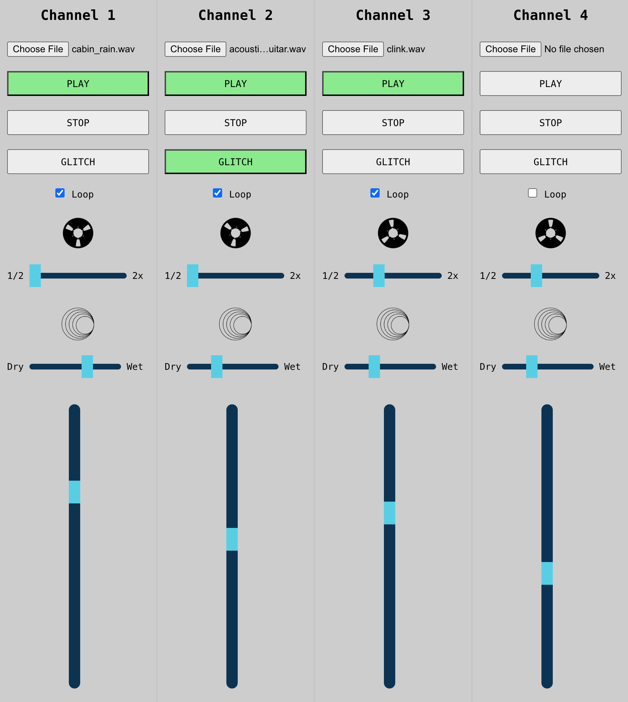

# Web Audio API Mixer

[Demo audio mixer](https://jmelvnsn.github.io/audio-mixer/) using Web Audio API / Web MIDI API.

Channels 1-4 gain are mapped to MIDI CC messages 1-4.

Channel 1 is pre-loaded with a guitar sample on page load. 

Start the demo mode by clicking play on Channel 1.

The loop checkbox will continuously loop playback of the sample.

Each channel has pitch control ranging from 1/2 speed to 2x (1/2x increments).

Each channel has a reverb effect. 

Each channel has glitch mode. When active, the playback speed will randomize every 75ms.

Try making the effect fully wet and setting the playback speed to 1/2x to get a classic ambient vibe.

