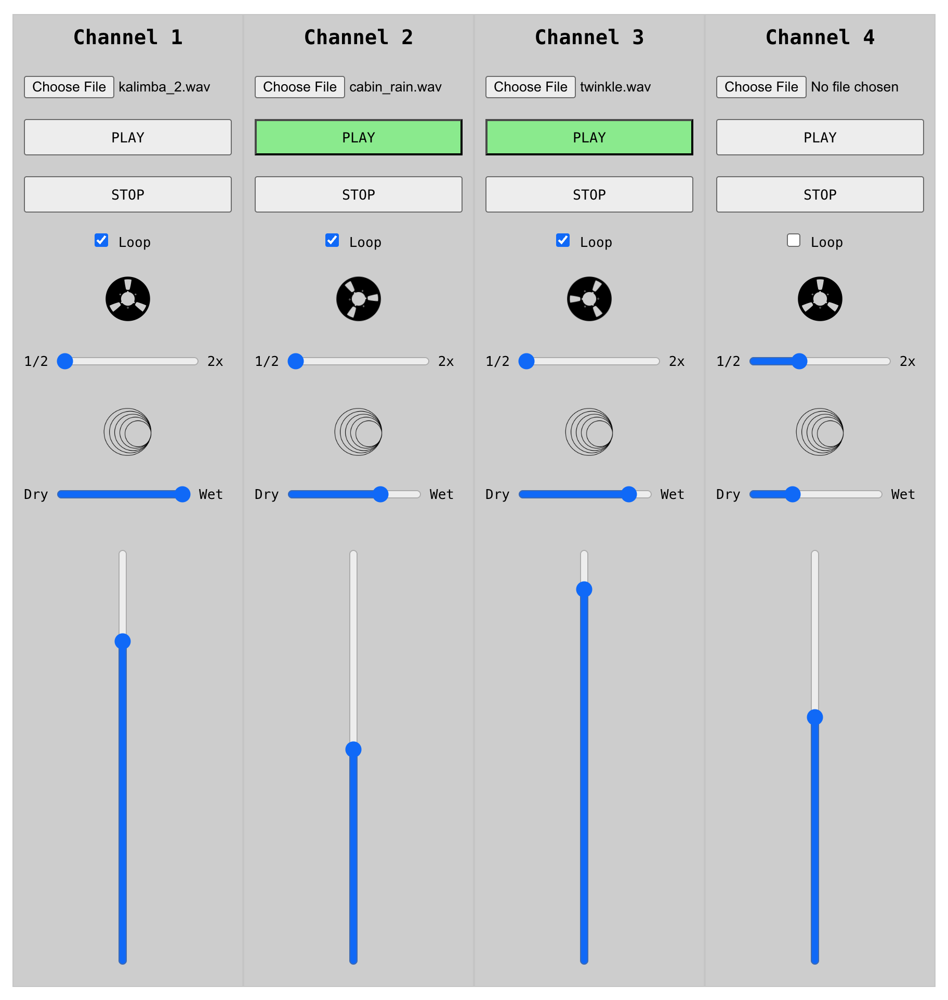

# What is this?

Demo audio mixer using Web Audio API anbd Web MIDI Api.

Channels 1-4 are mapped to MIDI CC 1-4.

Channel 1 is pre-loaded with a guitar sample. Inititate the demo mode by click play on Channel 1.

Each channel has pitch control ranging from 1/2 speed to 2x (in 1/2x increments).

Each channel has a reverb effect. Try making the effect fully wet and setting the playback speed at 1/2 to get a classic ambient vibe.

